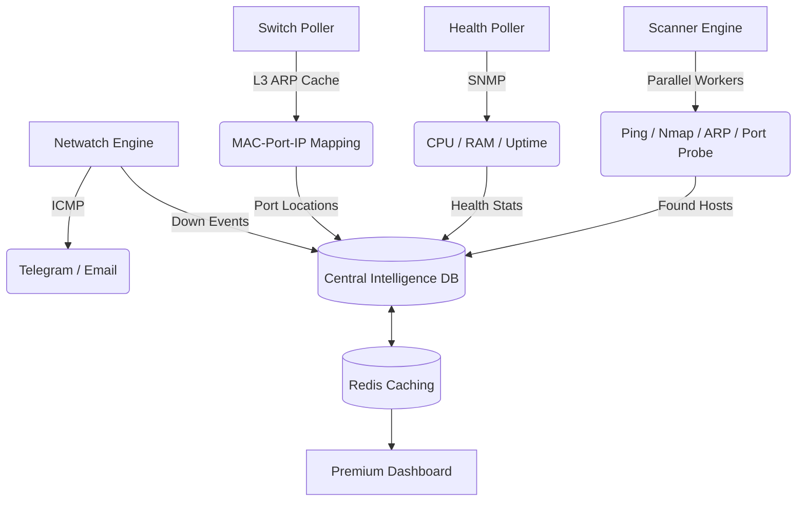
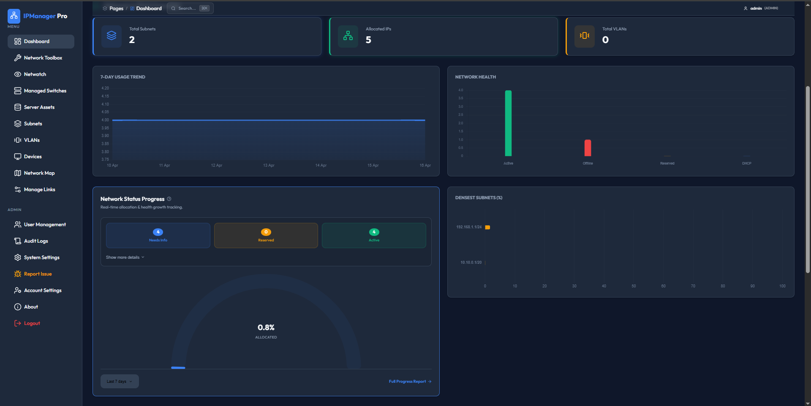
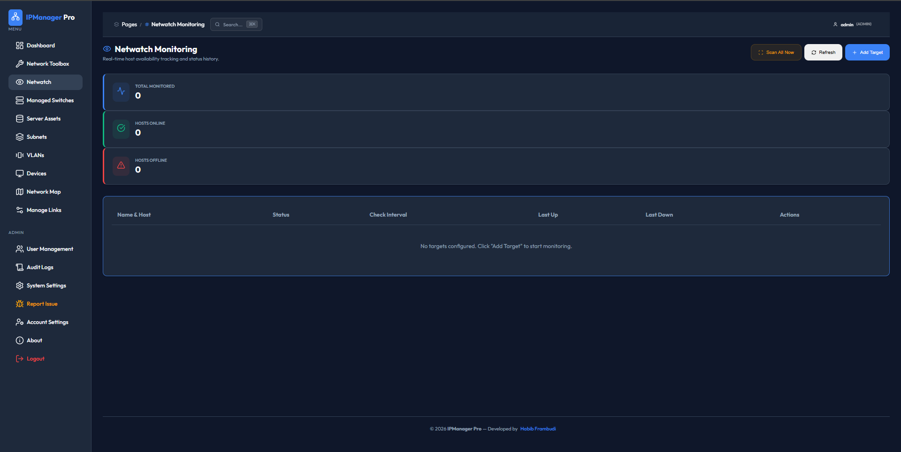

# 🚀 IPManager Pro: Enterprise IPAM & Active Network Monitoring

  
  
<i>Premium Enterprise IP Address Management & Active NMS for Modern Networks.</i>

---

IPManager Pro is a modern, high-speed **IP Address Management (IPAM)** and **Infrastructure Monitoring** platform. It provides real-time visibility into your network subnets, device health, and physical connectivity with a stunning dark-mode interface.

---

## 🏗️ System Architecture

How IPManager Pro maintains its high-accuracy network map:

---

## ✨ Key Features

### 📡 Active Netwatch Monitoring (New in v2.18.0)

- **Proactive Uptime Tracking**: Inspired by MikroTik Netwatch, monitor any host availability via highly configurable ICMP pings.
- **Multi-Channel Alerts**: Instant notifications via **Telegram Bot** and **Email** when a host goes DOWN or comes back UP.
- **Smart Thresholds**: Set failure counts before triggering an alert to avoid false positives on unstable links.
- **State-Change Logging**: Automated audit trail for every status change, integrated with the central logging system.

### 🔍 Advanced Discovery & IPAM

- **Parallel Subnet Scanning**: High-speed discovery with multiple background workers for large-scale networks.
- **Stealth Discovery (Multi-signal)**: Accurate detection via Ping, Nmap, ARP, and **TCP Port Probing**.
- **L3 ARP Logic**: Automatically discover hosts through ARP cache tables on managed switches/routers.
- **Physical Port Mapping**: Trace MAC addresses directly to physical switch ports and VLANs.

### 📊 Real-time Visualization

- **Live SNMP Tracking**: Streaming CPU, Memory, & Uptime data via _Server-Sent Events (SSE)_.
- **Interactive Analytics**: Chart.js integration for historical performance trends (1h to 48h).
- **Premium UI**: Sleek dark-mode interface with glassmorphism effects, powered by Lucide Icons.

---

## 📸 Screenshots

  <table style="width:100%">
    <tr>
      <td width="50%"></td>
      <td width="50%"></td>
    </tr>
  </table>

---

## ⚙️ Minimum Requirements

For smooth real-time monitoring and high-speed parallel scanning:

### Hardware

- **CPU**: 1 vCPU (2.0GHz) Minimum | 2 vCPU+ Recommended.
- **RAM**: 1 GB Free RAM | 2 GB+ Recommended.
- **Network**: 100 Mbps | 1 Gbps (Low latency SNMP).

### Software (detailed in requirements.txt)

- **PHP**: 8.1 or 8.2+
- **Database**: MariaDB 10.6+ / MySQL 8.0+
- **Tools**: `nmap`, `traceroute`, `iputils-ping`

---

## ⚡ Installation

### Option 1: Docker (Recommended)

1. Refer to [Docker Install Guide](DOCKER_INSTALL.md).
2. Run: `docker-compose up -d`
3. Access: `http://localhost:2025`

### Option 2: XAMPP / Linux (Manual)

1. Refer to [Standalone Install Guide](STANDALONE_INSTALL.md).
2. Import `sql/database.sql` to your database.
3. Access: `http://localhost/ipmanage`

---

## 🔐 Default Credentials

- **Username**: `admin`
- **Password**: `admin123`
  _(Please change your password immediately after first login)_

---

## 👨‍💻 Author & Support

**Habib Frambudi**  
If this project saves you time, consider supporting the developer:

- **Saweria (IDR)**: [saweria.co/Habibframbudi](https://saweria.co/Habibframbudi)
- **PayPal (USD)**: `habibframbudi@gmail.com`

---

_Powered by **Vanilla CSS**, **Lucide Icons**, and **Chart.js**._
