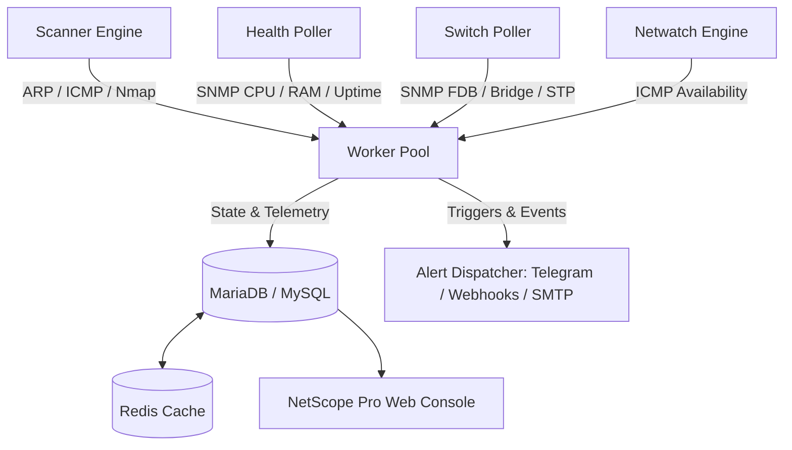
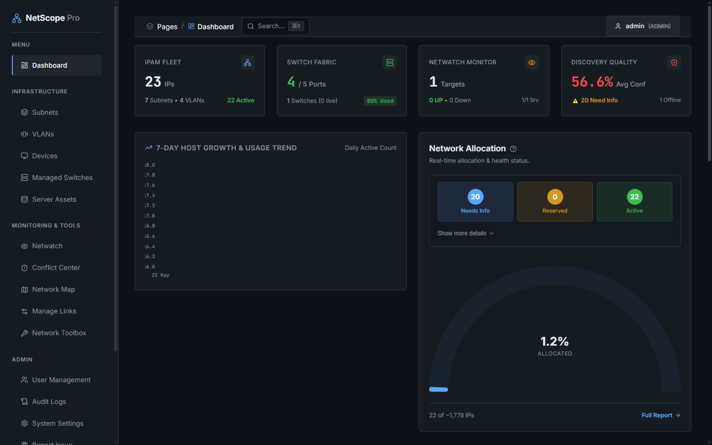
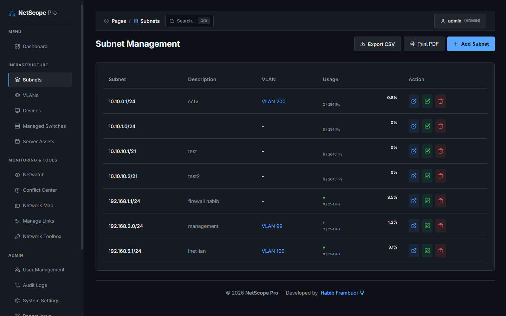
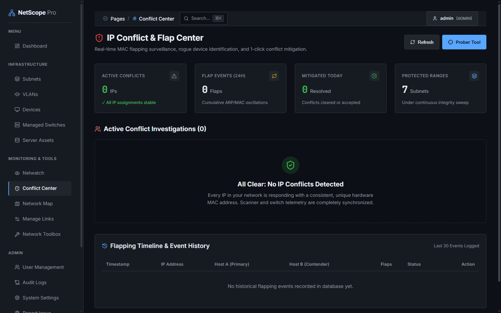
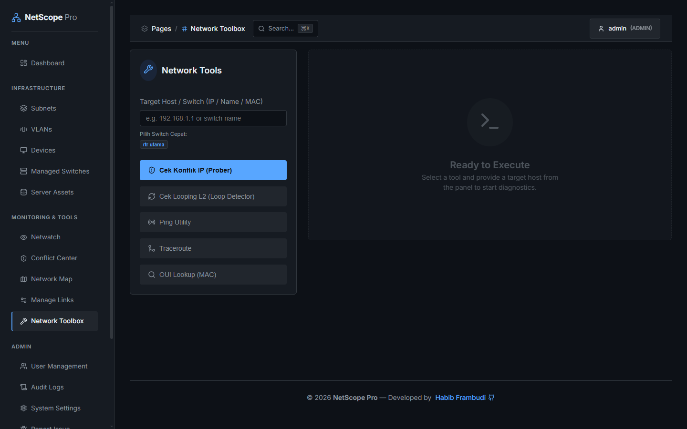
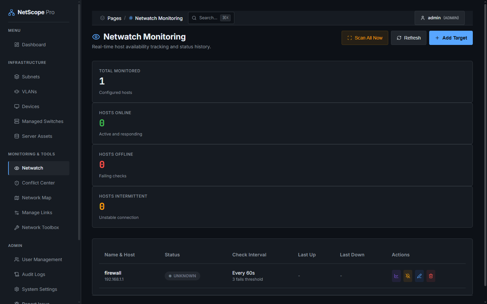
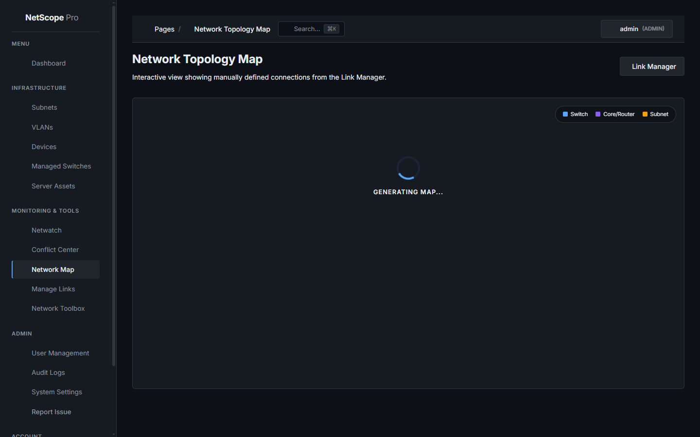

# NetScope Pro

> **IPAM as the Core, Network Intelligence as the Edge.**

[](https://github.com/frambudi75/NetScopePro/releases)
[](https://www.php.net/)
[](https://mariadb.org/)
[](LICENSE)

**NetScope Pro** is an IP Address Management (IPAM) system built for speed, clarity, and root-cause visibility. Where conventional IPAM tools function as passive spreadsheets, NetScope Pro correlates your subnet allocations with live Layer-2 physical switch ports, automated IP conflict forensics, and Spanning Tree loop diagnostics.

---

## 🏗️ System Architecture


```mermaid
graph TD
    A[Scanner Engine] -->|ARP / ICMP / Nmap| E[Worker Pool]
    B[Health Poller] -->|SNMP CPU / RAM / Uptime| E
    C[Switch Poller] -->|SNMP FDB / Bridge / STP| E
    D[Netwatch Engine] -->|ICMP Availability| E
    E -->|State & Telemetry| DB[(MariaDB / MySQL)]
    DB <--> Cache[(Redis Cache)]
    DB --> UI[NetScope Pro Web Console]
    E -->|Triggers & Events| Alert[Alert Dispatcher: Telegram / Webhooks / SMTP]
```

---

## 🔎 Network Diagnostics & Root Cause Analysis

NetScope Pro does not just alert you when an anomaly occurs; it correlates L2/L3 evidence to identify where and why:

### 1. IP Conflict & MAC Flap Center
- **Dual-Host Forensic Comparison**: Side-by-side card comparing incumbent host vs new claimant (MAC, OUI Vendor, physical switch port, VLAN, hostname, and ping responsiveness).
- **Trunk-Aware Flapping Analysis**: Distinguishes normal multi-switch uplink propagation from true IP/MAC collision and ARP thrashing.
- **1-Click Resolution**: Direct administrative actions from the alert row (Resolve, Accept New Host, or Acknowledge) with audit logging.

### 2. Layer-2 Loop & STP Diagnostics
- **Spanning Tree Protocol (STP/RSTP) State Polling**: Queries `dot1dStp` MIB tables to identify Root Bridge, root path cost, and per-port operational states (`forwarding`, `blocking`, `learning`).
- **Loop Mitigation Guard**: Identifies ports blocked by switch STP to isolate loops before broadcast storms escalate.
- **Inactive Link Filtering**: Automatically checks operational link status (`ifOperStatus`) to prevent false-positive alarms on unplugged ports.
- **Interactive L2 Loop Prober**: 6-phase diagnostic tool verifying bridge architecture, STP configuration, and topology change notifications (TCN).

---

## 📸 Screenshots

| NOC Operations Dashboard | IPAM Subnet Management |
| :---: | :---: |
|  |  |

| IP Conflict & Flap Center | L2 Loop & STP Diagnostics |
| :---: | :---: |
|  |  |

| Netwatch Host Monitoring | Layer-2 Topology Map |
| :---: | :---: |
|  |  |

---

## ✨ Core Features

### 📋 IP Address Management (IPAM)
- **Subnet Allocation & CIDR Hierarchy**: Visual utilization progress bars, address status tracking (Allocated, Reserved, Dynamic, Offline), and gateway/DNS management.
- **IP Intelligence Dossier (360° View)**: Single-click modal correlating IP &rarr; MAC &rarr; Switch Port &rarr; Vendor &rarr; SFP Optical telemetry.
- **Universal Search (`Ctrl+K` / `Cmd+K`)**: Rapid indexed search across subnets, switches, hosts, and IP records.
- **VLAN Management**: Track 802.1Q VLAN IDs, subnet bindings, and descriptions.

### 🔌 Switch Fabric & Physical Port Mapping
- **MAC-to-Port Correlation**: Tracks which physical port (`etherX`, `GigabitEthernetX`) each device is plugged into via SNMP FDB bridge tables.
- **SFP / Optical DOM Monitoring**: Displays transceiver vendor, part numbers, RX/TX optical signal levels, and temperatures.
- **Bandwidth & Port Telemetry**: Live and historical throughput counters (`ifHCInOctets` / `ifHCOutOctets`) with time-range charts.

### 📡 Proactive Netwatch Monitoring
- **Availability Tracking**: High-frequency ICMP polling with configurable failure count thresholds.
- **Multi-Channel Dispatcher**: Real-time notifications via **Telegram Bot**, Discord, Slack webhooks, and SMTP email.
- **State Change Audit**: Automated logging of every host status transition.

---

## ⚡ Quick Start

### Docker (Recommended)

1. Clone the repository:
   ```bash
   git clone https://github.com/frambudi75/NetScopePro.git
   cd NetScopePro
   ```

2. Start the stack:
   ```bash
   docker compose up -d
   ```

3. Open your browser:
   ```text
   http://localhost:2025
   ```

### Default Credentials
- **Username**: `admin`
- **Password**: `admin123`  
*(Change default credentials in Settings immediately after first login)*

---

## 📚 Documentation

- [Docker Deployment Guide](DOCKER_INSTALL.md)
- [Docker with SSL / Reverse Proxy](DOCKER_SSL.md)
- [Bare-Metal / Standalone (XAMPP & Linux) Installation](STANDALONE_INSTALL.md)
- [Release History & Detailed Changelog](CHANGELOG.md)

---

## ⚙️ System Requirements

### Hardware
- **CPU**: 1 vCPU (2.0 GHz) minimum | 2 vCPU+ recommended for large subnets
- **RAM**: 1 GB free RAM | 2 GB+ recommended
- **Network**: 100 Mbps minimum | 1 Gbps recommended for low-latency SNMP sweeps

### Software
- **PHP**: 8.1 or 8.2+
- **Database**: MariaDB 10.6+ or MySQL 8.0+
- **Dependencies**: `nmap`, `fping` / `iputils-ping`, `net-snmp`

---

## 👨‍💻 Author & License

**Habib Frambudi**  
- GitHub: [@frambudi75](https://github.com/frambudi75)
- Support: [saweria.co/Habibframbudi](https://saweria.co/Habibframbudi) | PayPal: `habibframbudi@gmail.com`

Distributed under the [MIT License](LICENSE).
