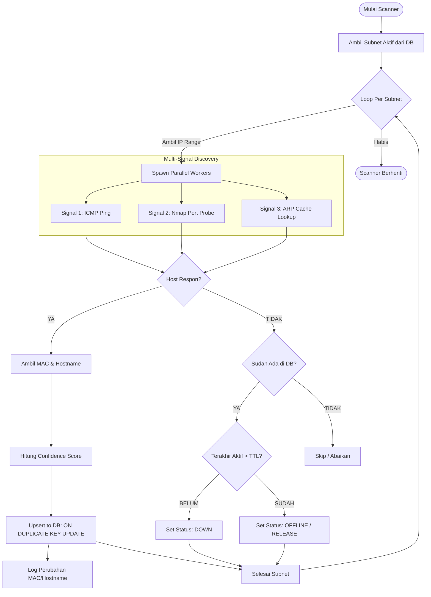

# 🗺️ IP Scanner & Discovery Logic Flow

Dokumen ini menjelaskan alur kerja mesin scanner **IPManager Pro** dalam menangani penemuan host, deteksi **Ghost IP**, dan rekonsiliasi **Duplicate IP**.

---

## 🏗️ Scanner Flowchart (Mermaid)

---

## 🛠️ Logika Utama

### 1. Anti-Ghost IP (Pencegahan Host Palsu)
Aplikasi tidak langsung menghapus IP yang tidak merespon (*No Response*).
- **Grace Period (TTL)**: Setiap host memiliki `last_seen`. Jika host mati, status diubah menjadi `down` namun data (MAC/Hostname) tetap dipertahankan.
- **Auto-Cleanup**: Data hanya akan benar-benar dilepas (*release*) jika waktu `down` melebihi ambang batas (contoh: 48 jam) untuk memastikan itu bukan gangguan jaringan sesaat.

### 2. Penanganan Duplicate IP (Rekonsiliasi)
Jika scanner menemukan IP yang sama namun dengan MAC Address berbeda:
- **MAC Tracking**: Sistem mendeteksi perubahan MAC (`ON DUPLICATE KEY UPDATE`).
- **Conflict Audit**: Perubahan ini dicatat di `audit_logs` agar administrator tahu jika ada perangkat yang diganti atau potensi *IP conflict/spoofing*.

### 3. Confidence Scoring (Tingkat Keyakinan)
Sistem memberikan skor berdasarkan jumlah sinyal yang diterima:
- **Ping Saja**: Skor 20 (Low) - Mungkin ghost IP atau port ICMP terbuka saja.
- **Ping + ARP**: Skor 70 (High) - Terverifikasi ada perangkat fisik (MAC).
- **Ping + ARP + Hostname**: Skor 100 (Verified) - Data lengkap terverifikasi.

---

*Generated by IPManager Pro Documentation System*
